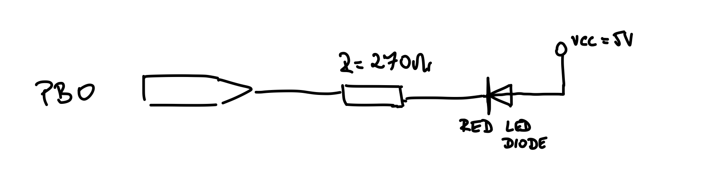

# Lab 1: David Zimniok

### Morse code

1. Listing of C code which repeats one "dot" and one "comma" (BTW, in Morse code it is letter `A`) on a LED. Always use syntax highlighting, meaningful comments, and follow C guidelines:

```c

#define LED_OUT PB0   // PB0
#define DOT 250 // Delay in milliseconds
#define COMMA 750 // Delay in milliseconds
#define PB0 8  

int main(void)
{
    // Set pin where on-board LED is connected as output
    pinMode(LED_OUT, OUTPUT);

    // Infinite loop
    while (1)
    {
        // Generate a lettre `A` Morse code
        digitalWrite(LED_OUT,HIGH);
        _delay_ms(DOT);
        digitalWrite(LED_OUT,LOW);
        _delay_ms(DOT);
        digitalWrite(LED_OUT,HIGH);
        _delay_ms(DOT);
        digitalWrite(LED_OUT,LOW);
        _delay_ms(COMMA);
        digitalWrite(LED_OUT,HIGH);
        _delay_ms(COMMA);
        digitalWrite(LED_OUT,LOW);
    }

    // Will never reach this
    return 0;
}
```

2. Scheme of Morse code application, i.e. connection of AVR device, LED, resistor, and supply voltage. The image can be drawn on a computer or by hand. Always name all components and their values!

   
