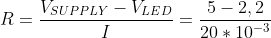

# Lab 2: Control of GPIO, LED, push button

## Preparation tasks (done before the lab at home)

1. Draw two basic ways to connect a LED to the output pin of the microcontroller: LED active-low, LED active-high.

&nbsp;
   
&nbsp;

2. [Calculate LED resistor value](https://electronicsclub.info/leds.htm) for typical LEDs. Let the LED current is 20 milli amps.

&nbsp;
   
&nbsp;

   | **LED color** | **Supply voltage** | **LED current** | **LED voltage** | **Resistor value** |
   | :-: | :-: | :-: | :-: | :-: |
   | red | 5&nbsp;V | 20&nbsp;mA | 2&nbsp;V | 150&nbsp;ohm |
   | green | 5&nbsp;V | 20&nbsp;mA | 2.2&nbsp;V | 140&nbsp;ohm |
   | blue | 5&nbsp;V | 20&nbsp;mA | 3.3&nbsp;V | 85&nbsp;ohm |

> Note that, equation was generated by [Online LaTeX Equation Editor](https://www.codecogs.com/latex/eqneditor.php) using the following code.

3. Draw the basic ways to connect a push button to the microcontroller input pin: button active-low, button active-high.

&nbsp;
   
&nbsp;
